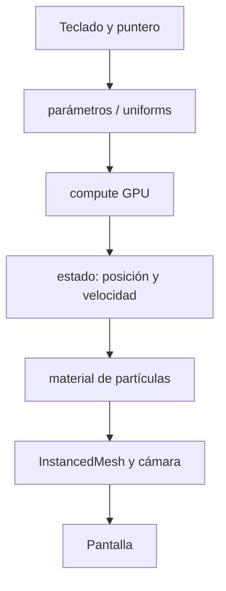

# Unidad 3: Fuerzas

[Link local](http://localhost:5173/)
# Bitácora del instrumento de partículas

**Unidad:** U3 · Forces Instrument  
**Fecha de corte:** 26 de agosto de 2026  
**Autor:** Santiago Mateus  
**Sesión:** antes de la sesión 4

> Esta bitácora reconstruye la relación entre intención, arquitectura, decisiones de diseño, pruebas y cambios realizados con IA. Las observaciones marcadas como **pendientes** deben completarse después de ejecutar la prueba correspondiente.
> 
## 1. Mapa del sistema

| Parte | Qué hace | Evidencia |
|---|---|---|
| Estado | Guarda posición y velocidad de cada partícula en buffers GPU. | [`createSimulation.js`](src/simulation/createSimulation.js#L18-L20) |
| Fuerzas | Suma viento, fuerza radial, vórtice, drag y explosión localizada. | [`createSimulation.js`](src/simulation/createSimulation.js#L64-L108) |
| Integración | Actualiza primero la velocidad y luego la posición con Euler semiimplícito. | [`createSimulation.js`](src/simulation/createSimulation.js#L110-L128) |
| Condiciones de borde | Reintroduce partículas mediante coordenadas periódicas. | [`createSimulation.js`](src/simulation/createSimulation.js#L123-L126) |
| Render | Usa `SpriteNodeMaterial`, una máscara circular y `InstancedMesh`. | [`createSimulation.js`](src/simulation/createSimulation.js#L132-L166) |
| Parámetros | Expone `dt`, `timeScale`, límites, tamaño, fuerzas y parámetros de explosión. | [`parameters.js`](src/simulation/parameters.js#L6-L31) |
| Cámara | Perspectiva con `OrbitControls`; el puntero se proyecta sobre el plano Z=0. | [`main.js`](src/main.js#L25-L65) |
| Panel LAB | Permite editar escala temporal, velocidad, tamaño y fuerzas. | [`labPanel.js`](src/ui/labPanel.js#L56-L116) |
| Teclado | Centraliza presets, fuerza radial, viento, vórtice, tamaño, explosiones y pausa. | [`main.js`](src/main.js#L145-L220) |

- **Mini explosiones:** se generan mientras `L` está presionada.
- **Explosión grande:** se dispara una vez al superar tres segundos de pulsación continua.
- **Predicción:** las partículas cercanas al cursor deben recibir un impulso hacia afuera más fuerte que las lejanas.
- **Decisión:** la explosión se aplica directamente al estado de velocidad para que también sea visible cuando el sistema está pausado por `F`.

## 2. Score visual

**Referencia sonora:** *LesAlpx*.

| Tramo | Intención visual | Control conducido |
|---|---|---|
| Entrada | Mostrar el campo de partículas y establecer una tensión radial baja. | Cursor, `F` para iniciar gradualmente |
| Construcción | Hacer más evidente el flujo y la densidad de las ráfagas. | `U/I`, `ArrowUp/Down`, `A/D` |
| Clímax | Producir una perturbación localizada y expansiva. | `L` corta para mini explosiones; `L` sostenida para explosión grande |
| Descenso | Reducir velocidad y dejar que el sistema se estabilice. | `F` para detener gradualmente; `J/K` para modular vórtice |
| Cierre | Recuperar una configuración legible y dejar espacio visual. | `R`, `C/B`, cursor |

El audio no controla automáticamente la simulación: la interpretación se conduce manualmente mediante pocos controles expresivos.

## 3. Bitácora de IA

| Momento | Prompt o intención | Cambio aceptado | Corrección, prueba o rechazo |
|---|---|---|---|
| 1 | Cambiar la nube cúbica inicial por un sistema astral y conservar propiedades y teclas. | Se exploraron distribuciones espirales, estrella y órbitas. | Se rechazó el reemplazo completo del mapeo de teclas. |
| 2 | Hacer natural la transición U/I/O y cambiar enfoques con 1/2/3. | Se propuso un blend gradual y objetivos de cámara. | Se corrigió un blend invertido que congelaba el sistema. |
| 3 | Activar movimiento solo con `L` y frenar al soltar. | Se añadió una compuerta y frenado progresivo. | Después se deshizo por petición del estudiante. |
| 4 | Convertir `Espacio` en explosión según la duración. | Se implementó radio variable y explosión radial. | Después se deshizo por petición del estudiante; `Espacio` volvió a invertir radial. |
| 5 | Dar estética morada astral y crear explosiones con `L`. | Se modificaron fondo, partículas, panel y fuerza localizada. | Se corrigió la expresión de falloff al aparecer un pipeline WebGPU inválido. |
| 6 | Iniciar pausado y usar `F` para arrancar/detener gradualmente. | Se añadió `motionBlend` y rampa de entrada/salida. | Se conservó sin tocar el resto del mapeo. |
| 7 | Formar ráfagas; U girar, I fusionar/expandir y O formar shuriken. | Se añadió una distribución de brazos y objetivos astrales. | Debe validarse visualmente y comprobarse el build actual antes de presentar. |

## 4. Autoevaluación ponderada

Las valoraciones siguientes son **provisionales**. Deben actualizarse con enlaces a capturas, observaciones fechadas o commits antes de la presentación.

| Criterio | Peso | Qué demuestra la evidencia | Valoración (0-5) | Evidencia |
|---|---:|---|---:|---:|
| Trazabilidad y comprensión del sistema | 25 | Puedo ubicar estado, fuerzas, integración, render, controles y cambios de IA. | 5 | [Mapa del sistema](#2-mapa-del-sistema), [`createSimulation.js`](src/simulation/createSimulation.js), [`main.js`](src/main.js) |
| Verificación del algoritmo de fuerzas | 25 | Aislé fuerzas, formulé predicciones y comparé resultados. | 5 | [Ficha de fuerzas](#3-ficha-de-fuerzas), [Registro de pruebas](#4-registro-de-pruebas) |
| Diseño de fuerzas e intención | 20 | Las fuerzas producen una intención perceptible y no una trayectoria dibujada. | 5 | [Explosión de `L`](#explosión-de-l), [Score visual](#5-score-visual) |
| Instrumento, score e interpretación | 15 | El score conecta escucha y controles manuales. | 5 | [Score visual](#5-score-visual), [Controles en `README.md`](README.md#L35-L55) |
| Experimentación y criterio frente a la IA | 10 | Comparé alternativas, corregí errores y rechacé cambios incompatibles. | 5 | [Bitácora de IA](#6-bitácora-de-ia) |
| Entrega técnica y documentación | 5 | La URL abre y la bitácora permite verificar el proceso. | 5 | [Instrumento funcional y publicado](#1-instrumento-funcional-y-publicado), [`README.md`](README.md) |
| **Total** | **5** |  |  5 | 

### Evidencias que faltan completar

- [ ] Captura de LAB con cada una de las cinco pruebas base.
- [ ] Observación escrita después de cada predicción.
- [ ] Captura de PERFORMANCE sin el panel.
- [ ] Verificación de la URL pública en ventana incógnita.
- [ ] Resultado exitoso de `npm run build` sobre la versión final.
- [ ] Enlace a un commit o diff que permita identificar los cambios aceptados de IA.
- [ ] Sustituir las valoraciones provisionales por la autoevaluación definitiva.

[Volver a la bitacora principal](../README.md)

